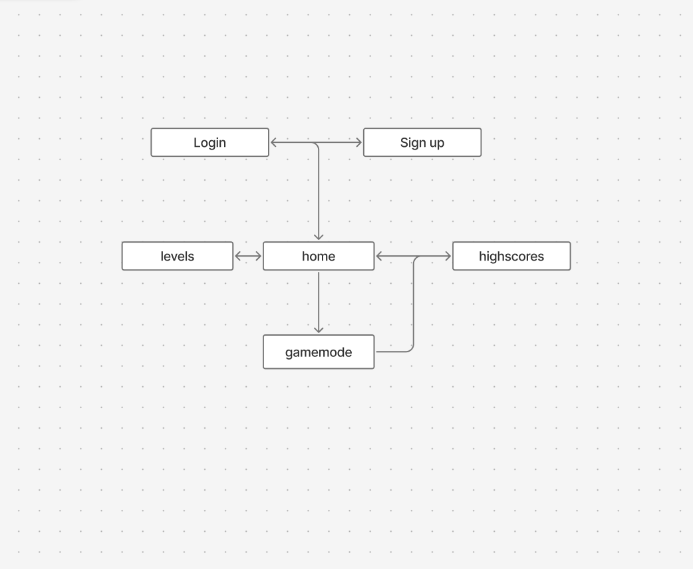
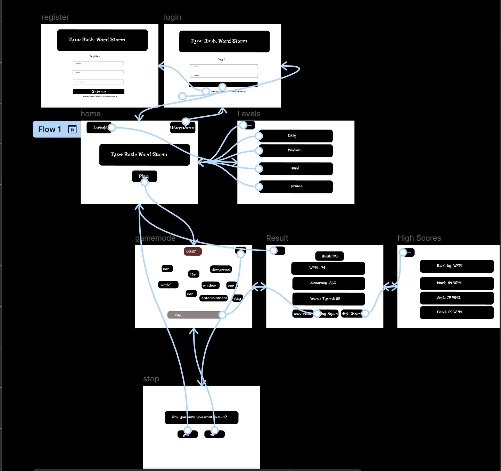
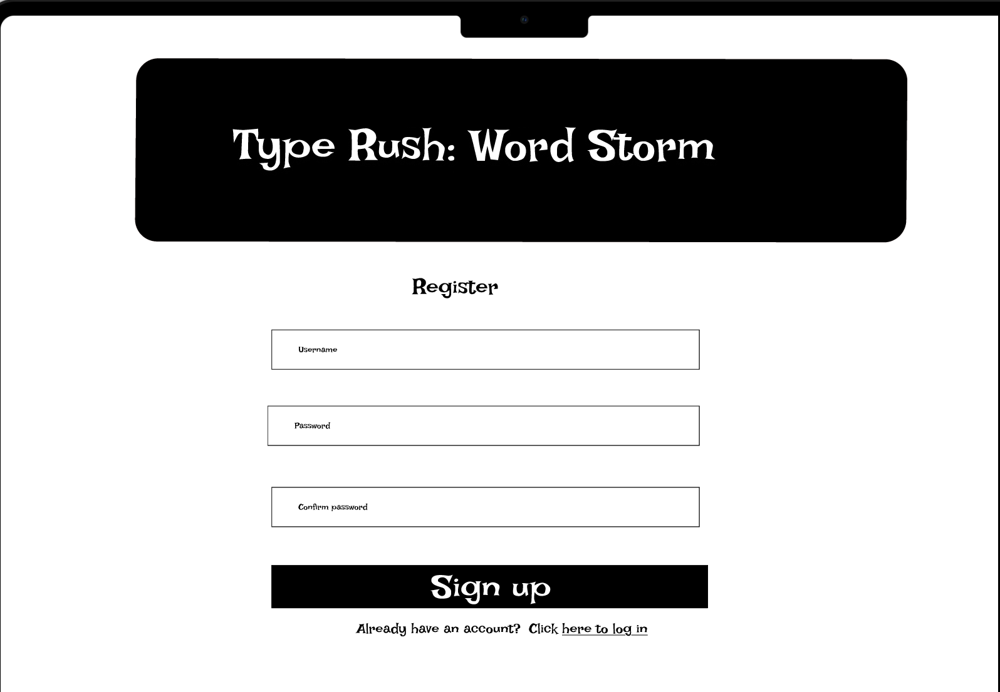
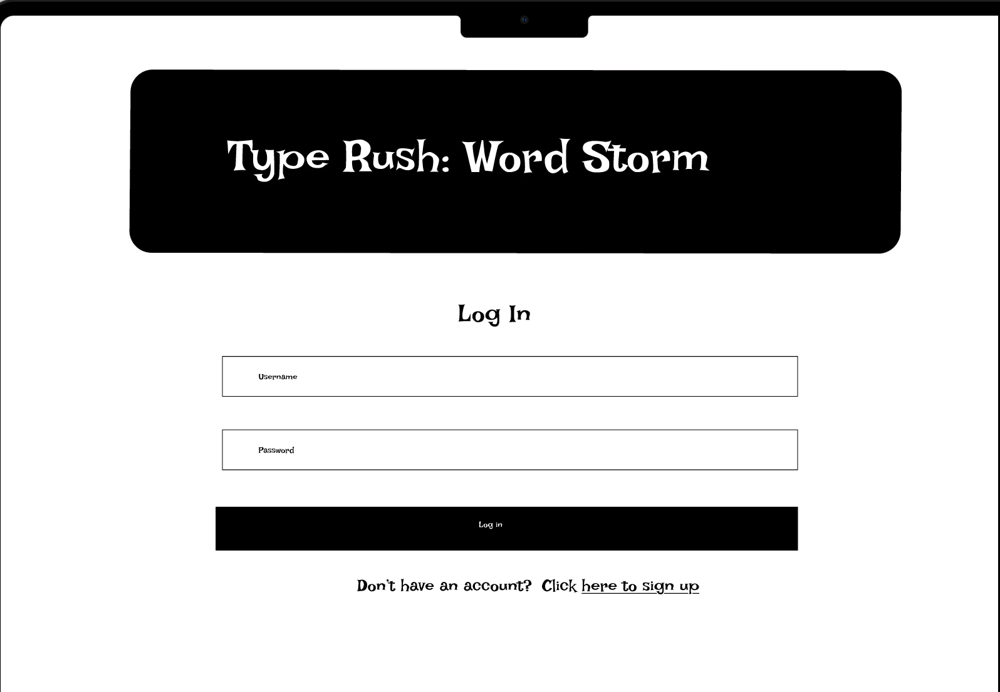
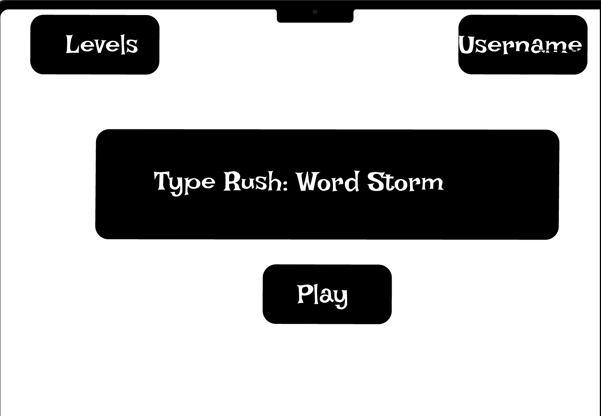
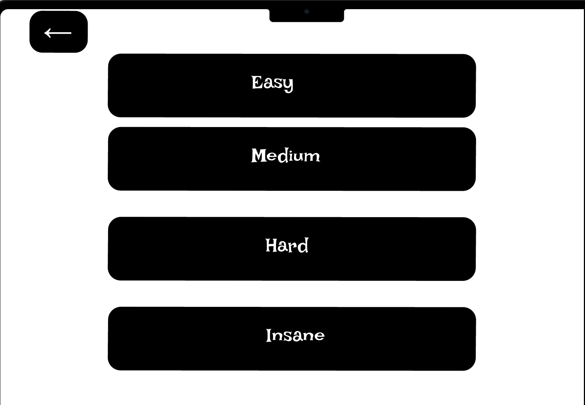
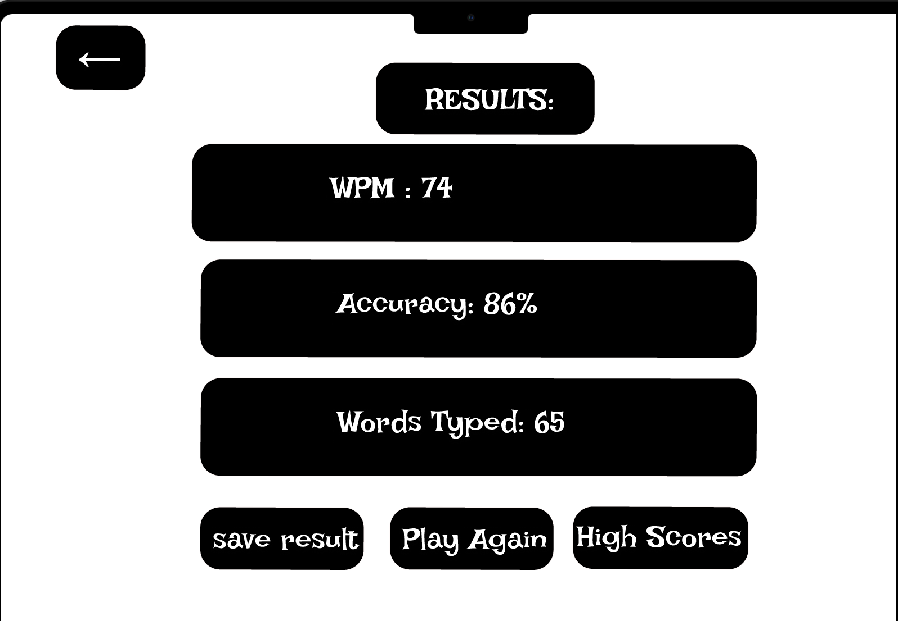

# ⌨️ TypeRush: Word Storm   

## Overview  

**TypeRush: Word Storm** is a fast-paced web-based typing game where words dynamically appear on the screen and players must type them before time runs out.  

Each round challenges the player to achieve the highest **Words Per Minute (WPM)** and **accuracy** possible.  
The game introduces increasing difficulty modes (“Easy”, “Medium”, “Hard”, “Insane”) that affect word spawn speed and Time-To-Live (TTL).  

Players can **register**, **log in**, play multiple sessions, and track their **high scores** over time.  
The app uses **Express.js** and **MongoDB**, with AJAX interactions for updating scores and leaderboards.


---
Try it out here: 
---
https://final-project-hailemariammersha.onrender.com


## Data Model  

The app uses two main collections: **Users** and **GameSessions**.

### User Schema
- Stores player authentication info and performance stats  
- Linked to multiple GameSessions  

```javascript
{
  username: "haile",
  email: "haile@example.com",
  passwordHash: "...bcrypt hash...",
  bestWPM: 92,
  bestAccuracy: 97,
  totalGames: 25,
  createdAt: ISODate("2025-10-30T00:00:00Z")
}
```

### GameSession Schema
- Stores round results for a single play session  

```javascript
{
  userId: ObjectId("..."), // references User
  difficulty: "Hard",
  wpm: 78,
  accuracy: 91,
  correct: 45,
  wrong: 8,
  missed: 6,
  duration: 60,
  date: ISODate("2025-10-30T00:00:00Z")
}
```

---

## Application Flow & Wireframes  



Figma protoype


I have prepared a prototype. Please follow this link to look at the interactive game play. 
[Interactive Figma Wireframes – TypeRush: Word Storm](https://www.figma.com/design/wH4xwAUKECzLjbES7X8BLu/TypeRush-wordstorm?node-id=5-33&p=f)

Below are the screens of the *TypeRush* application, showing user flow and UI structure.  
Insert your images in the placeholders (``).

---

###  Register Page  
**Purpose:** Allow new users to create an account.  
Fields: Username, Email, Password.  
Redirects to the Login page after successful registration.  




---

###  Login Page  
**Purpose:** Authenticate existing users.  
Fields: Username, Password.  
Redirects to the Home page upon success.   


---

###  Home Page  
**Purpose:** Welcome page after login.  
Buttons:  
- “Play” → Starts a game  
- “Levels” → Opens difficulty options  
- “High Scores” → Opens leaderboard  




---

### Levels Page  
**Purpose:** Choose difficulty for the game.  
Options: Easy, Medium, Hard, Insane.  
Each difficulty sets different word speeds and TTL values.  
  


### Stop Modal  
**Purpose:** Confirm quitting the game early.  
Text: “Are you sure you want to quit?”  
Buttons: Yes (Home), No (Resume).  

 **Placeholder:**  
``

---

### 🏁 Result Page  
**Purpose:** Display results after the timer ends.  
Shows:
- WPM  
- Accuracy  
- Words Typed  
Buttons: “Play Again”, “High Scores”, “Save Progress”.  




---

###  High Scores Page  
**Purpose:** Display top player performances.  
Table columns: Username | Best WPM | Accuracy  
Option to return to Home or Results.  


`


##  Research Topics  

| Topic | Description | Points |
|--------|--------------|--------|
| **React.js Integration** | Use React to build the front-end interface and handle state for timer, words, and user input. | 6 |
| **Tailwind CSS** | Used for consistent dark theme, responsiveness, and minimal styling setup. | 2 |
| **AJAX / Fetch API** | Update live scores and leaderboard without refreshing. | 2 |
| **Timer & TTL Logic** | Custom ES6 logic controlling difficulty and word spawn rate. | 2 |
| **ESLint + Nodemon** | Auto-reload and code quality enforcement during dev. | 1 |

**Total Research Points:** 10  

---

##  Technical Setup  

- **Backend:** Express.js  
- **Database:** MongoDB (Mongoose ODM)  
- **Templating:** Handlebars (server-side) or React (optional frontend upgrade)  
- **Session Auth:** express-session + bcrypt for password hashing  
- **CSS Framework:** Tailwind CSS  

---

## Site Map  

```
/register         → Register new users  
/login            → User login  
/home             → Main hub  
/levels           → Select difficulty  
/play             → Game screen  
/stop             → Pause confirmation  
/results          → Show results  
/highscores       → View leaderboard  
/api/save         → Save round data (AJAX)  
/api/leaderboard  → Fetch leaderboard JSON  
```

---

##  User Stories  

1. As a new player, I can register and create an account.  
2. As a user, I can log in to access my saved stats and scores.  
3. As a player, I can select a difficulty level before playing.  
4. As a player, I can type words under time pressure and see live scores.  
5. As a player, I can pause or quit during a game.  
6. As a player, I can see my WPM, accuracy, and words typed at the end.  
7. As a player, I can view global high scores and compare my performance.  

---

## 📖 References  

1. [React Documentation](https://react.dev/learn)  
2. [TailwindCSS Docs](https://tailwindcss.com/docs)  
3. [MDN Fetch API](https://developer.mozilla.org/en-US/docs/Web/API/Fetch_API)  
4. [Mongoose Docs](https://mongoosejs.com/docs/)  
5. [ESLint Docs](https://eslint.org/docs/latest/)  
6. [Chart.js](https://www.chartjs.org/docs/latest/) – for future visualizations  

---

## Summary  

**TypeRush: Word Storm** combines fast-paced gameplay with web technologies to deliver an interactive typing challenge.  
Tech stack: **Express, MongoDB, AJAX, Tailwind, and React integration**.
